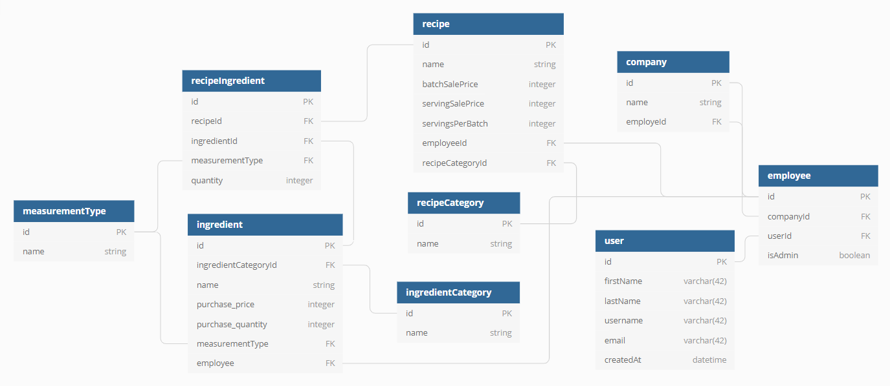

<h1>PRIX</h1>
PRIX's REST API

<!-- #### Key Features:

- Inventory Costs - Add and view an ingredient's purchase quantity and price.
- Recipe Costs - View a recipe's total cost
  - Ingredient Cost - View a breakdown of an ingredient's cost for the amount used in a recipe.
- Recipe Sale Prices - Add and view sales prices per recipe batch and serving.
- Recipe Profits - View the profits of a recipe per batch and serving. -->

#### To Run

1. From this repo's home page, click the green **Code** button.
2. On the dropdown menu, click the **Use SSH** link and copy the provided URL.
3. In the terminal, execute **git clone _paste SSH url here_**.
<!-- 4. Cd into **prix-api/src/api** and open **DataManager.js**. Change the **remoteURL** variable to your local API\* server's url and save.
4. From the root directory, execute **npm start**. -->

\*Be sure to [visit the PRIX-client repo](https://github.com/tannerb9/PRIX-client) to set up the client-side app.

#### Tech Used

- Python
- Django REST Framework

#### ERD

#### Contributors

Tanner Brainard
